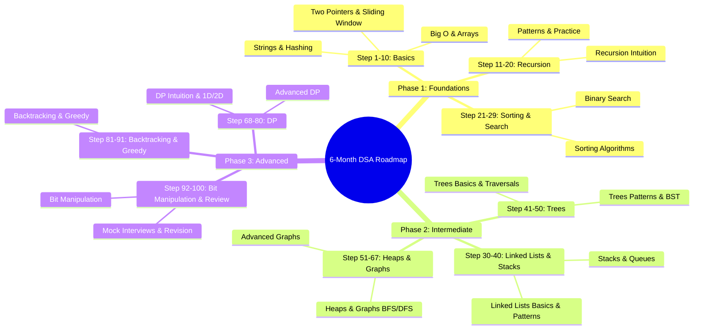

# 6-Month DSA Roadmap — Week by Week

> 10 hours/week. Deep understanding. No shortcuts.

**Overall Progress:**

<progress value="0" max="100"></progress> 0/100 steps completed

---

**Progress Tracking:** Check off each step as you complete it to visualize your journey!

**Status Options:** Update each step's status to [Not Visited], [In Progress], [Hold], or [Completed]. When you start working on a step (e.g., by clicking its link or opening related files), change it to [In Progress]. You can manually edit the status for any step at any time.

**Remarks:** Add personal notes in [remarks.md](remarks.md).

---

## Phase 1: Foundations (Month 1–2)

The goal here is to build rock-solid fundamentals. No rushing. If you can't do arrays and strings cleanly, trees and graphs will destroy you.

- [Not Visited] **Step 1: Big O Theory**  
  What is time/space complexity and WHY it matters  
  [📖 Read Notes](../week-01/01-big-o-notation.md)

- [Not Visited] **Step 2: Arrays Basics**  
  Arrays: memory layout, access patterns, basic operations  
  [📖 Read Notes](../week-01/02-arrays-basics.md)

- [Not Visited] **Step 3: Practice Array Problems**  
  Problems: traversal, min/max, reverse, rotate  
  [💻 Practice Session](../week-01/03-practice-session.md)

- [Not Visited] **Step 4: Two Pointer Pattern**  
  Two pointer pattern (sorted arrays, pair sums)

- [Not Visited] **Step 5: Sliding Window Technique**  
  Sliding window (subarrays of fixed/variable size)

- [Not Visited] **Step 6: Kadane's Algorithm**  
  Kadane's algorithm (max subarray — the gateway drug to DP)

- [Not Visited] **Step 7: Array Techniques Practice**  
  Solve 8-10 problems on these techniques

- [Not Visited] **Step 8: String Manipulation**  
  String manipulation, immutability, character arrays

- [Not Visited] **Step 9: String Patterns**  
  Common patterns: palindromes, anagrams, frequency counting

- [Not Visited] **Step 10: String Problems Practice**  
  Solve 8-10 string problems

- [Not Visited] **Step 11: Hashing Fundamentals**  
  What hashing actually is (not just "use a HashMap")

- [Not Visited] **Step 12: HashMap and HashSet Usage**  
  Frequency maps, two-sum pattern, grouping

- [Not Visited] **Step 13: Collision Handling**  
  Collision handling conceptually

- [Not Visited] **Step 14: Hashing Problems Practice**  
  Solve 8-10 hashing problems

- [Not Visited] **Step 15: Recursion Intuition**  
  What recursion really is (not "a function calling itself")

- [Not Visited] **Step 16: Call Stack and Base Cases**  
  The call stack, base cases, recursive leap of faith

- [Not Visited] **Step 17: Simple Recursion**  
  Simple recursion: factorial, fibonacci, power

- [Not Visited] **Step 18: Recursion Problems**  
  Solve 6-8 recursive problems

- [Not Visited] **Step 19: Recursion on Arrays/Strings**  
  Recursion on arrays and strings

- [Not Visited] **Step 20: Subsets and Permutations**  
  Generate subsets, permutations (intro to backtracking)

- [Not Visited] **Step 21: Recursion Patterns Practice**  
  Solve 8-10 recursive pattern problems

- [Not Visited] **Step 22: Basic Sorting Algorithms**  
  Bubble, Selection, Insertion (understand, don't memorize)

- [Not Visited] **Step 23: Merge Sort**  
  Merge Sort (divide and conquer thinking)

- [Not Visited] **Step 24: Quick Sort**  
  Quick Sort (partitioning, pivot selection)

- [Not Visited] **Step 25: Sorting Implementation**  
  Implement merge sort and quick sort from scratch

- [Not Visited] **Step 26: Sorting Problems**  
  Solve 6-8 sorting-related problems

- [Not Visited] **Step 27: Binary Search on Arrays**  
  Binary search on sorted arrays (the classic)

- [Not Visited] **Step 28: Binary Search on Answer**  
  Binary search on answer (search space reduction)

- [Not Visited] **Step 29: Binary Search Practice**  
  Solve 8-10 binary search problems

---

## Phase 2: Intermediate + Patterns (Month 3–4)

This is where you shift from "I can solve if I've seen it" to "I can figure it out."

- [Not Visited] **Step 30: Singly Linked List**  
  Singly linked list from scratch

- [Not Visited] **Step 31: Linked List Operations**  
  Insertion, deletion, traversal, reversal

- [Not Visited] **Step 32: Linked List Implementation**  
  Implement a linked list without looking anything up

- [Not Visited] **Step 33: Linked List Problems**  
  Solve 6-8 linked list problems

- [Not Visited] **Step 34: Fast/Slow Pointer**  
  Fast/slow pointer (cycle detection, middle finding)

- [Not Visited] **Step 35: Merging and Intersection**  
  Merge two sorted lists, intersection point

- [Not Visited] **Step 36: Linked List Patterns Practice**  
  Solve 8-10 linked list pattern problems

- [Not Visited] **Step 37: Stack Internals**  
  Stack internals, when to use stacks

- [Not Visited] **Step 38: Monotonic Stack**  
  Monotonic stack pattern

- [Not Visited] **Step 39: Stack Problems**  
  Problems: valid parentheses, next greater element, min stack

- [Not Visited] **Step 40: Queue and Circular Queue**  
  Queue, circular queue

- [Not Visited] **Step 41: Deque**  
  Deque, sliding window maximum with deque

- [Not Visited] **Step 42: BFS Preview**  
  BFS preview (queues are the backbone of BFS)

- [Not Visited] **Step 43: Queue Problems**  
  Solve 6-8 queue and deque problems

- [Not Visited] **Step 44: Tree Basics**  
  What is a tree, binary tree, terminology

- [Not Visited] **Step 45: Traversals (Recursive)**  
  Inorder, preorder, postorder (recursive)

- [Not Visited] **Step 46: Traversals (Iterative)**  
  Inorder, preorder, postorder (iterative)

- [Not Visited] **Step 47: Level Order Traversal**  
  Level order traversal (BFS on trees)

- [Not Visited] **Step 48: Tree Traversal Problems**  
  Solve 8-10 tree traversal problems

- [Not Visited] **Step 49: Tree Properties**  
  Height, diameter, balanced check, LCA

- [Not Visited] **Step 50: Path Sum Problems**  
  Path sum problems, symmetric tree

- [Not Visited] **Step 51: Tree Pattern Problems**  
  Solve 8-10 tree pattern problems

- [Not Visited] **Step 52: BST Property**  
  BST property, search, insert, delete

- [Not Visited] **Step 53: BST Operations**  
  Validate BST, kth smallest, inorder successor

- [Not Visited] **Step 54: BST Problems**  
  Solve 8-10 BST problems

- [Not Visited] **Step 55: Heap Internals**  
  How heaps work internally (array-based tree)

- [Not Visited] **Step 56: Heap Types**  
  Min-heap, max-heap, heapify

- [Not Visited] **Step 57: Top-K Problems**  
  Top-K problems, merge K sorted lists

- [Not Visited] **Step 58: Heap Problems**  
  Solve 8-10 heap problems

- [Not Visited] **Step 59: Graph Representations**  
  Graph representations (adjacency list/matrix)

- [Not Visited] **Step 60: BFS**  
  BFS from scratch

- [Not Visited] **Step 61: DFS**  
  DFS from scratch

- [Not Visited] **Step 62: Graph Concepts**  
  Connected components, cycle detection

- [Not Visited] **Step 63: BFS/DFS Problems**  
  Solve 8-10 BFS/DFS problems

- [Not Visited] **Step 64: Topological Sort**  
  Topological sort

- [Not Visited] **Step 65: Dijkstra's Algorithm**  
  Dijkstra's shortest path

- [Not Visited] **Step 66: Union-Find**  
  Union-Find (Disjoint Set)

- [Not Visited] **Step 67: Advanced Graph Problems**  
  Solve 8-10 advanced graph problems

## Phase 3: Advanced + Interview Level (Month 5–6)

This is where you become dangerous.

- [Not Visited] **Step 68: DP Intuition**  
  What DP really is (not memorization of patterns)

- [Not Visited] **Step 69: Core DP Concepts**  
  Overlapping subproblems, optimal substructure

- [Not Visited] **Step 70: Top-Down Approach**  
  Top-down (memoization) approach

- [Not Visited] **Step 71: Basic DP Problems**  
  Fibonacci, climbing stairs, coin change

- [Not Visited] **Step 72: DP Problems**  
  Solve 6-8 DP problems

- [Not Visited] **Step 73: Bottom-Up Approach**  
  Bottom-up (tabulation) approach

- [Not Visited] **Step 74: 1D DP Problems**  
  House robber, decode ways, longest increasing subsequence

- [Not Visited] **Step 75: Conversion**  
  Convert any top-down solution to bottom-up

- [Not Visited] **Step 76: 1D DP Problems**  
  Solve 8-10 1D DP problems

- [Not Visited] **Step 77: 2D DP Setup**  
  Grid-based DP (unique paths, min path sum)

- [Not Visited] **Step 78: Sequence DP**  
  Longest common subsequence

- [Not Visited] **Step 79: Edit Distance**  
  Edit distance

- [Not Visited] **Step 80: 2D DP Problems**  
  Solve 6-8 2D DP problems

- [Not Visited] **Step 81: Knapsack Variants**  
  Knapsack variants (0/1, unbounded)

- [Not Visited] **Step 82: Partition Problems**  
  Partition problems, subset sum

- [Not Visited] **Step 83: Advanced DP Problems**  
  Solve 8-10 advanced DP problems

- [Not Visited] **Step 84: Backtracking Template**  
  Backtracking template

- [Not Visited] **Step 85: Classic Problems**  
  N-Queens, Sudoku solver

- [Not Visited] **Step 86: Combinations and Permutations**  
  Subsets, combinations, permutations (revisited deeper)

- [Not Visited] **Step 87: Backtracking Problems**  
  Solve 8-10 backtracking problems

- [Not Visited] **Step 88: Greedy Choice Property**  
  Greedy choice property, when greedy works

- [Not Visited] **Step 89: Greedy Problems**  
  Activity selection, jump game, meeting rooms

- [Not Visited] **Step 90: Greedy vs DP**  
  Greedy vs DP: how to tell the difference

- [Not Visited] **Step 91: Greedy Problems**  
  Solve 8-10 greedy problems

- [Not Visited] **Step 92: Bit Operations**  
  Bit operations: AND, OR, XOR, shifts

- [Not Visited] **Step 93: Common Problems**  
  Single number, power of 2, counting bits

- [Not Visited] **Step 94: Trie Basics**  
  Trie basics (if time permits)

- [Not Visited] **Step 95: Bit Manipulation Problems**  
  Solve 8-10 bit manipulation problems

- [Not Visited] **Step 96: Mock Interviews**  
  Simulate real interview conditions

- [Not Visited] **Step 97: Timed Problems**  
  2 problems in 45 minutes

- [Not Visited] **Step 98: Review Weak Areas**  
  Review weak areas

- [Not Visited] **Step 99: Top Problems**  
  Revisit top 20 most important problems

- [Not Visited] **Step 100: Reflect & Review**  
  Goal: Perform under pressure. You're ready.

### Week 19 — Dynamic Programming: Intuition
**Hours: 10 | Concepts: 2 | Problems: 6–8**

- [Not Visited] **Step 1: Understand DP**  
  What DP really is (not memorization of patterns)

- [Not Visited] **Step 2: Learn Core Concepts**  
  Overlapping subproblems, optimal substructure

- [Not Visited] **Step 3: Master Top-Down Approach**  
  Top-down (memoization) approach

- [Not Visited] **Step 4: Practice Basic Problems**  
  Fibonacci, climbing stairs, coin change

- [Not Visited] **Step 5: Solve Problems**  
  Solve 6-8 DP problems

- [Not Visited] **Step 6: Reflect & Review**  
  Goal: See the recursive structure, then optimize

### Week 20 — DP: 1D Problems
**Hours: 10 | Concepts: 2 | Problems: 8–10**

- [Not Visited] **Step 1: Learn Bottom-Up Approach**  
  Bottom-up (tabulation) approach

- [Not Visited] **Step 2: Practice 1D DP Problems**  
  House robber, decode ways, longest increasing subsequence

- [Not Visited] **Step 3: Master Conversion**  
  Convert any top-down solution to bottom-up

- [Not Visited] **Step 4: Solve Problems**  
  Solve 8-10 1D DP problems

- [Not Visited] **Step 5: Reflect & Review**  
  Goal: Convert any top-down solution to bottom-up

### Week 21 — DP: 2D Problems
**Hours: 10 | Concepts: 2 | Problems: 6–8**

- [Not Visited] **Step 1: Learn 2D DP Setup**  
  Grid-based DP (unique paths, min path sum)

- [Not Visited] **Step 2: Master Sequence DP**  
  Longest common subsequence

- [Not Visited] **Step 3: Learn Edit Distance**  
  Edit distance

- [Not Visited] **Step 4: Practice Problems**  
  Solve 6-8 2D DP problems

- [Not Visited] **Step 5: Reflect & Review**  
  Goal: Set up 2D DP tables confidently

### Week 22 — DP: Patterns & Advanced
**Hours: 10 | Concepts: 2 | Problems: 8–10**

- [Not Visited] **Step 1: Learn Knapsack Variants**  
  Knapsack variants (0/1, unbounded)

- [Not Visited] **Step 2: Master Partition Problems**  
  Partition problems, subset sum

- [Not Visited] **Step 3: Practice Advanced DP**  
  Solve 8-10 advanced DP problems

- [Not Visited] **Step 4: Reflect & Review**  
  Goal: Map any new DP problem to a known pattern

### Week 23 — Backtracking
**Hours: 10 | Concepts: 2 | Problems: 8–10**

- [Not Visited] **Step 1: Learn Backtracking Template**  
  Backtracking template

- [Not Visited] **Step 2: Practice Classic Problems**  
  N-Queens, Sudoku solver

- [Not Visited] **Step 3: Master Combinations and Permutations**  
  Subsets, combinations, permutations (revisited deeper)

- [Not Visited] **Step 4: Solve Problems**  
  Solve 8-10 backtracking problems

- [Not Visited] **Step 5: Reflect & Review**  
  Goal: Apply the backtracking template to any constraint problem

### Week 24 — Greedy Algorithms
**Hours: 10 | Concepts: 2 | Problems: 8–10**

- [Not Visited] **Step 1: Learn Greedy Choice Property**  
  Greedy choice property, when greedy works

- [Not Visited] **Step 2: Practice Greedy Problems**  
  Activity selection, jump game, meeting rooms

- [Not Visited] **Step 3: Compare Greedy vs DP**  
  Greedy vs DP: how to tell the difference

- [Not Visited] **Step 4: Solve Problems**  
  Solve 8-10 greedy problems

- [Not Visited] **Step 5: Reflect & Review**  
  Goal: Prove greedy works before coding

### Week 25 — Bit Manipulation + Misc
**Hours: 10 | Concepts: 3 | Problems: 8–10**

- [Not Visited] **Step 1: Learn Bit Operations**  
  Bit operations: AND, OR, XOR, shifts

- [Not Visited] **Step 2: Practice Common Problems**  
  Single number, power of 2, counting bits

- [Not Visited] **Step 3: Explore Trie Basics**  
  Trie basics (if time permits)

- [Not Visited] **Step 4: Solve Problems**  
  Solve 8-10 bit manipulation problems

- [Not Visited] **Step 5: Reflect & Review**  
  Goal: Comfortable with bit tricks

### Week 26 — Mock Interviews + Revision
**Hours: 10 | Problems: 10–12 (timed)**

- [Not Visited] **Step 1: Simulate Interview Conditions**  
  Simulate real interview conditions

- [Not Visited] **Step 2: Practice Timed Problems**  
  2 problems in 45 minutes

- [Not Visited] **Step 3: Review Weak Areas**  
  Review weak areas

- [Not Visited] **Step 4: Revise Top Problems**  
  Revisit top 20 most important problems

- [Not Visited] **Step 5: Reflect & Review**  
  Goal: Perform under pressure. You're ready.

---

## Key Principles Throughout

1. **Never move on until you truly understand.** Falling behind schedule is fine. Faking understanding is not.
2. **Solve problems without hints first.** Struggle for 20–30 minutes minimum.
3. **After solving, read other solutions.** There's always a cleaner way.
4. **Revise weekly.** Friday = revisit Monday's problems.
5. **Track what you struggle with.** Patterns emerge. Attack weaknesses.

---

## Weekly Time Split (10 hours)

| Activity | Hours |
|----------|-------|
| Concept study (reading notes) | 2 |
| Code implementation | 3 |
| Problem solving | 4 |
| Revision & reflection | 1 |
